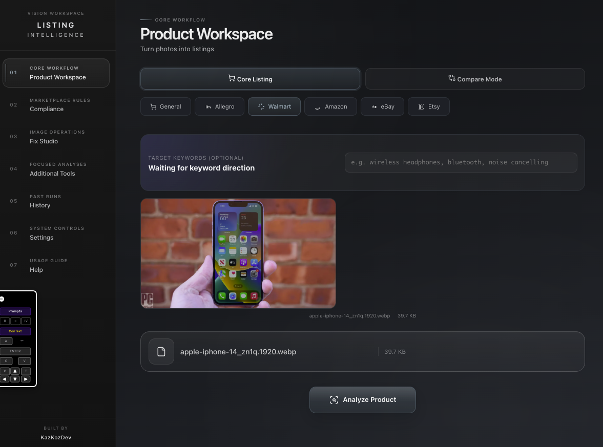

<br><p align="center">
  
</p><br><br>


From a single product photo to a marketplace-ready listing.<br>
Analyze the product, fix image issues, and generate better content with LLMs, OCR, and generative image models.

## Features

- **End-to-end workflow:** analyze, verify, correct, compare, and export from one workspace.
- **Compliance review:** structured findings, evidence overlays, and verifier-backed diffs instead of prose-only output.
- **Fix Studio:** deterministic correction steps such as relighting, outpainting, upscaling, and text or watermark cleanup.
- **Product context:** category, attributes, and optional reference imagery to strengthen verification.
- **Marketplace coverage:** workflows for channels such as Amazon, Walmart, Allegro, and Etsy.
- **Catalog operations:** competitor comparison, SEO generation, and batch processing for repeatable listing work.
- **Product-grade system design:** typed APIs, caching, usage tracking, multi-provider routing, and Dockerized local deployment.



## Tech Stack

- **Frontend:** React 19, TypeScript, and Vite
- **Backend:** FastAPI and Pydantic
- **Models:** Ollama, OpenAI, Anthropic, Google, and Azure
- **Pipelines:** OCR, object detection, quality scoring, relighting, upscaling, outpainting, and inpainting
- **DevOps:** Pytest, Playwright, GitHub Actions, and Docker

## Quick Start

### Clone the repository

```bash
git clone https://github.com/KazKozDev/LISTING-INTELLIGENCE.git
cd LISTING-INTELLIGENCE
```

### Local development

From the repository root:

```bash
cp .env.example .env
pip install -e ".[dev]"
uvicorn api.main:app --reload --port 8000
```

In a second terminal:

```bash
cd frontend
npm install
npm run dev
```

Open:

- Frontend: [http://localhost:5173](http://localhost:5173)
- API docs: [http://localhost:8000/docs](http://localhost:8000/docs)

### One-click launcher on macOS

```bash
./start.command
```

The launcher creates a virtual environment if needed, installs missing dependencies, starts the backend and frontend in Terminal tabs, and opens the app in the browser.

### Docker

```bash
cp .env.example .env
docker compose up --build
```

Default ports:

- Backend: `8000`
- Frontend: `3000`

## Usage

### Analyze a product image

1. Open Product Workspace.
2. Upload a product image.
3. Select the marketplace.
4. Run the full analysis flow to generate listing-oriented output, quality observations, and structured results.

### Review compliance and fix the image

1. Open Compliance.
2. Upload an image and select the marketplace.
3. Optionally add product title, category, attributes, and a reference image to strengthen verification.
4. Review the assessment, structured findings, source tiers, confidence, and evidence overlays.
5. Launch Fix Studio to apply deterministic corrections such as relighting, outpainting, upscaling, or text removal.
6. Compare before/after findings using structured verification diffs instead of prose-only changes.

### Review a listing source

Use the backend listing-analysis endpoint when you need to review a listing URL or pasted listing text against the same marketplace-oriented workflow.

## Configuration

Copy `.env.example` to `.env` and choose a provider.

Supported provider modes in the example config:

- `ollama`
- `openai`
- `grok`
- `groq`
- `anthropic`
- `google`
- `azure`

The default configuration uses local Ollama with `qwen3-vl:8b`. The frontend also exposes runtime overrides for provider, model, API key, and base URL in Settings.

## API Surface

The FastAPI backend includes endpoints for:

- general file analysis
- product analysis and full listing analysis
- marketplace listing URL or pasted listing review
- SEO generation
- compliance review and compliance fixes
- competitor comparison
- batch analysis
- object detection, OCR, quality scoring, relighting, outpainting, upscaling, and region erase operations

For endpoint details, see [docs/API.md](docs/API.md).

## Verification Model

- Rule-based checks cover dimensions, aspect-ratio guidance, file size, and selected marketplace background heuristics.
- OCR-backed checks surface visible text, screen-like UI content, and text-linked evidence excerpts.
- Detector-backed checks surface people, multi-object clutter, and text or logo-like overlay regions when available.
- Product context can be passed from the UI or API to inform category-aware heuristics and lightweight reference-image comparison.
- Fix Studio and Compliance prefer structured findings for diffs and ranking when verifier output is available.

## Documentation

- [docs/QUICKSTART.md](docs/QUICKSTART.md)
- [docs/API.md](docs/API.md)
- [docs/ECOMMERCE_GUIDE.md](docs/ECOMMERCE_GUIDE.md)
- [docs/EXPORT_GUIDE.md](docs/EXPORT_GUIDE.md)
- [docs/INDUSTRY_TEMPLATES.md](docs/INDUSTRY_TEMPLATES.md)

## License

PolyForm Noncommercial 1.0.0 - see [LICENSE](LICENSE) and [COMMERCIAL-LICENSE.md](COMMERCIAL-LICENSE.md)

## Contact

If you like this project, please give it a star.

For questions, feedback, or support:

[LinkedIn](https://www.linkedin.com/in/kazkozdev/)
[Email](mailto:kazkozdev@gmail.com)
